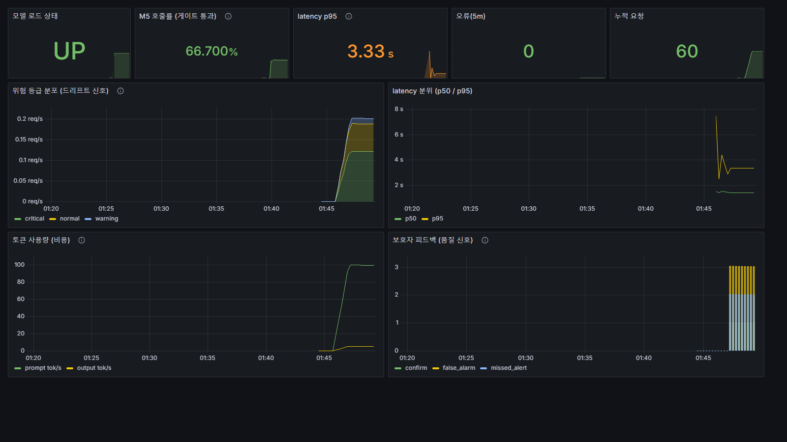

# qwen-llmops

**Qwen2.5-1.5B 기반 응급 판단 SLM 파이프라인 — SafeWave-AI M5 모듈.**

독거인 안전 모니터링 시스템의 SLM(Small Language Model) 계층. M1~M4 전문가 모델 출력과
**분당 vital 시계열(≤60행)**을 통합해 응급 위험도를 판단한다. 룰베이스 게이트로 호출을 절감하고,
**RPi5(arm64) 배포를 목표로** **GGUF Q5_K_M**로 양자화·패키징했다.

> 운영 흐름은 **개발(Dev) → 운영(Ops)** 전 주기를 단독 트랙으로: 평가 하니스 → 모델/양자화 →
> 서빙 API → CI/CD → 모니터링/피드백/거버넌스. 메인 시스템(rp5)과 게이트·판정표를 동기화해 같은 결과를 낸다.

> ### ⚠️ 범위·근거 고지 (Scope & Evidence)
> 이 저장소는 **시스템/LLMOps 엔지니어링 연구**다. **의료기기·임상 검증이 아니다.** 어떤 수치도
> 임상적 유효성·환자 안전을 주장하지 않는다. 근거 등급의 항목별 분리는 [`docs/evidence_matrix.md`](docs/evidence_matrix.md).
> - **평가 데이터셋은 100% 합성 생성**(`scripts/gen_golden_set_v3.py`, `random.gauss`/`randint` 기반). 실환자·실측 로그 아님.
> - **Track A 1.000은 white-box 정책 일관성 점검** — 게이트 임계와 평가 오라클이 같은 정책을 공유한다. held-out·독립 라벨 성능이 아니다.
> - 저장된 latency는 **개발 PC(x86) 결과**다. **RPi5 실기 실측 로그는 아직 없음**(투영치만) → 상태는 "배포 완료"가 아니라 **"배포를 목표로 구성"**.
> - **보호자 피드백·드리프트 점검은 기능 구현 완료**. 단, **실제 운영 데이터(`ai:emergency` 스트림)로 돌린 실적은 없음**(합성/스모크만).
> - **Track R은 판정표 준수율**이다 — 정답이 게이트 점수에서 출발하는 규칙이라 실제 판정 정확도가 아니다.

## 현재 상태 (2026-09-25)

| 영역 | 상태 | 근거 |
|---|---|---|
| 룰 게이트 | 구현 · 경계 테스트 73/73 · rp5 게이트와 무작위 20,000건 불일치 0 | `tests/`, [rp5 동기화](docs/rp5_sync_20260925.md) |
| M5 (Q5_K_M) Track B | strict **317/328** · grounded **323/328** (합성 시계열셋) | [현재 성능](#현재-성능-1000-시계열셋) |
| M5 Track R (판정표 준수율) | M2 켬 **77/98** · M2 꺼짐 **70/102** — 오답 전부 과대 | `eval/eval_track_r.py` |
| 서빙 · 모니터링 | 개발 PC 도커 기동 확인(API·Redis·Prometheus·Grafana), 9패널(stat 5·시계열 4) 값 표시 | [스크린샷](docs/img/grafana_m5_llmops_20260925.png) |
| CI / CD | CI: 문법·M5 import·경계 테스트·Track A mock·Track R 스모크 / CD: arm64 이미지 → GHCR (`latest` 09-25 재빌드, M5 로드 결함 수정본) | `.github/workflows/` |
| RPi5 실기 | **미측정** — 지연·메모리는 개발 PC 값뿐 | [근거 매트릭스](docs/evidence_matrix.md) |

---

## 아키텍처

```
M1 (낙상)   M2 (생체신호+시계열)   M3 (환경음)   M4 (한국어 STT)
     └──────────┴────────────────────┴──────────────┘
                          │
              emergency_score.py            ← 룰 게이트 (score<0.6 → M5 스킵)
              · 도메인 가중 + 복합 보정       ← 시계열 에스컬레이션(지속경고/악화추세)
              · 우회: 위기 vital·낙상 확정·긴급 음성·낙상+위험음 → 0.65
                          │  score ≥ 0.6
                   M5: Qwen2.5-1.5B          ← GGUF Q5_K_M(배포) / fp32·ONNX(기준)
                   · 시스템 규칙 + few-shot   ← 시계열 압축요약 프롬프트
                          │
              risk_level / reason  →  ai:result · ai:emergency (Redis Streams)
```

**설계 원칙**
- M5(SLM)는 응급지수 임계(0.6) 초과 시에만 호출 — 불필요한 추론 비용 차단.
- 이중 백엔드: **ONNX Runtime**(base 1.5B fp32, 0.5B) + **llama.cpp**(GGUF, 배포). M5는 컨테이너 격리.
- 평가는 **Track A**(룰 게이트가 옳게 호출하는가), **Track B**(호출된 모델 raw 추론 품질),
  **Track R**(판정표 등급 준수율, rp5 방식)로 분리. 세 트랙은 정답의 출처가 달라 한 숫자로 합치지 않는다.
- Redis Streams 비동기(`ai:result` → `ai:emergency`). 운영 설계상 데이터는 Redis만 사용하고 키 TTL은 ≤ 3600s로 제한한다.

---

## 모델 라인업

| 백엔드 | 파일/임플 | 크기 | Track B(스냅샷 1000) | 비고 |
|---|---|---|---|---|
| base 1.5B fp32 | `qwen_15b` (ONNX) | 7.1 GB | 1.000 (164/164) | 합성 스냅샷셋 참조·디버그(미배포) |
| **Q5_K_M (배포 목표)** | `qwen_15b_gguf_q5` (llama.cpp) | 1.29 GB | **0.988 (162/164)** | **RPi5 배포 후보** — 합성 경계 서맥(HR=36/40) 케이스 통과 |
| Q4_K_M | `qwen_15b_gguf` (llama.cpp) | 1.06 GB | 0.976 (160/164) | 경량 롤백 후보 — 합성 경계 서맥 케이스 미탐 |
| (구) 0.5B | `qwen_05b` (ONNX) | — | — | 초기 베이스라인 |

- **크기·경계 서맥 근거**: [`docs/model_card.md`](docs/model_card.md) 「백엔드 비교」 표.
- **Track B 수치 원장**: [`docs/metrics_summary.json`](docs/metrics_summary.json)과 그 파일이 지목한 로컬 raw dump. 시계열셋 Q5 수치는 아래 [현재 성능](#현재-성능-1000-시계열셋).
- **latency 원본**: 룰 게이트는 `docs/bench_result_20260624.json`, M5 추론은 `reports/qwen_responses_20260629.json`·`20260630.json`. 모두 개발 PC이며 RPi5 결과가 아니다.

백엔드 선택: 하니스 `--impl {05b,15b,gguf}`, 서비스 `SLM_BACKEND` env. 상세는 [`docs/model_card.md`](docs/model_card.md).

---

## 디렉터리 구조

```
qwen_llmops/
├── inference/
│   ├── emergency_score.py   # 룰 게이트(M1-M4 통합 + 시계열 에스컬레이션)
│   ├── risk_policy.py       # 판정표 rubric_level (rp5 동기화, Track R 정답)
│   ├── qwen_15b.py          # M5: Qwen2.5-1.5B ONNX + 시계열 프롬프트·가드레일
│   ├── qwen_gguf.py         # M5: GGUF(llama.cpp) 백엔드(qwen_15b 상속)
│   ├── qwen_05b.py          # (구) 0.5B ONNX
│   └── utils.py             # ORT 프로바이더·유틸
├── eval/
│   ├── eval_qwen_reasoning.py   # 평가 하니스 (Track A/B, 강건성, 토큰)
│   └── eval_track_r.py          # Track R — 판정표 준수율(운영 구간·seed held-out, rp5 방식)
├── data/
│   └── qwen_golden_set.jsonl    # 1000 시계열 골든셋(clean 500 + noisy 500)
├── scripts/
│   ├── gen_golden_set_v3.py     # 시계열 골든셋 생성기(현행)
│   ├── gen_golden_set_v2.py     # 스냅샷 노인분포 생성기
│   ├── export_qwen_gguf.py      # fp32 → GGUF 변환
│   ├── check_drift.py           # 운영 등급분포 드리프트 점검(Ops)
│   ├── bench_latency.py         # prefill/decode 분리 측정 + RPi5 투영
│   └── monitoring_smoke.py      # 모니터링 스모크 트래픽(합성) — 대시보드 재현용
├── service/
│   ├── api.py               # FastAPI 서빙(/evaluate·/feedback·/health·/metrics)
│   └── qwen_service.py      # Redis 스트림 소비 루프
├── docs/
│   ├── model_card.md        # 배포 모델 명세
│   ├── ops_runbook.md       # 롤백·모니터링·드리프트 런북
│   ├── evidence_matrix.md   # 주장별 근거 등급(구현/자동검증/합성평가/실기기)
│   └── rp5_sync_20260925.md # rp5 M5 09-24 작업 동기화·검토 결과
├── .github/workflows/
│   ├── ci.yml               # CI(문법·M5 import·경계테스트 73·Track A mock·Track R 스모크)
│   └── cd.yml               # CD(태그·수동 → GHCR arm64 이미지 빌드·푸시 + 이미지 내부 스모크)
├── docker-compose.yml
└── requirements.txt
```

---

## 룰 게이트 — `inference/emergency_score.py`

M1~M4 출력으로 응급지수(0.0~1.0)를 계산. 임계(0.6) 초과 시 M5 호출.

| 도메인 | 가중치 | 입력 |
|---|---|---|
| fall (M1) | 40% | `fall_score` × `_conf_weight(infer_confidence)` |
| vital (M2) | 30% | HR/RR 이상 점수 × `_conf_weight` |
| sound (M3) | 15% | 환경음 가중치 × 분류 신뢰도 |
| speech (M4) | 15% | 응급 키워드 히트 |

**생체신호 임계 (화이트박스 경계)**

| | 경고 (0.55) | 위기 (1.0) |
|---|---|---|
| HR (BPM) | ≤55 또는 ≥100 | ≤40 또는 ≥130 |
| RR (회/분) | ≤10 또는 ≥22 | ≤5 또는 ≥35 |

**주요 보정**
- **복합 위험 배율**: 활성 도메인(≥0.5) 2개→×1.20(피크≥0.90), 3개→×1.35, 4개→×1.50(피크≥0.70).
- **Vital Bypass**: HR/RR 위기값 → score 최솟값 0.65.
- **낙상 확정 우회**: M1 K/N 집계 성립(`fall_detected`) → score 최솟값 0.65. *(rp5 동기화)*
- **긴급 음성 우회**: M4 긴급 문장 유사 매칭(`emergency_phrase_detected`) → score 최솟값 0.65. *(rp5 동기화)*
  두 우회는 rp5 게이트와 무작위 입력 20,000건에서 점수·플래그 불일치 0 ([`docs/rp5_sync_20260925.md`](docs/rp5_sync_20260925.md)).
- **Keyword+Fall 보너스**: 키워드 ≥1 AND fall_raw ≥0.25 → +0.15.
- **시계열 에스컬레이션** *(신규)*: `compute_emergency_score(expert, time_series=...)` — 최근 20분
  warn-or-worse ≥0.6(지속 경고) 또는 HR/RR 악화 추세 → score floor 0.6. `time_series=None`이면
  스냅샷 전용(기존과 100% 동일, 하위호환).

---

## M5 추론 — `inference/qwen_15b.py` / `qwen_gguf.py`

```
입력: 상태 한 줄(낙상·심박·호흡·환경·소견) + [1h추세] 시계열 압축요약
출력: {"risk_score": 0~1, "risk_level": "normal|warning|critical", "reason": "..."}
```

- **프롬프트**: system 규칙 + few-shot(기본 4 + 시계열 2: 악화추세·지속경고) + 현재 상태.
- **시계열 프롬프트**: `_series_prompt` — 추세요약(`HR 75→110 상승, 경고 12/30분`)을 **신호 있을 때만**
  노출(정상·안정 시계열은 생략 → 과승급·토큰 낭비 방지).
- **JSON prefix forcing** + 첫 완결 JSON early-stop으로 잡음 차단.
- **가드레일**: `vital_override`(위기 vital을 normal로 다운그레이드 방지), `hallucination_guard`(미탐지 '알람' 언급 금지).
- `QWEN_MAX_NEW_TOKENS` 40~80(기본 64).

---

## 평가 하니스 — `eval/eval_qwen_reasoning.py`

### 골든셋 (`data/qwen_golden_set.jsonl`) — **합성 생성 데이터**
> **전량 프로그램 생성(synthetic).** 실환자·실측 센서 로그가 **아니다**. 생성기 `scripts/gen_golden_set_v3.py`가
> 분포에서 표본추출(`random.gauss`/`randint`)한다. 프롬프트를 이 셋으로 튜닝했으므로 아래 Track B 점수는
> **held-out이 아닌 in-distribution** 값이다(과적합 가능성 존재).

**1000 시계열셋** = clean 500 + noisy 500(모순신호 twin). 각 케이스 = M1~M4 스냅샷 + `time_series`(1분 1행, ≤60행).

| 구성 | 내용 |
|---|---|
| 카테고리 | normal 506 · no_signal 182 · fall_only 138 · vital_crisis 110 · multi_domain 64 |
| 시계열 패턴 | stable · gradual_deterioration · acute_spike · recovery · noisy_stable · sparse · grid(빈 시계열) |
| vital 분포 | 노인 vital **문헌 분포를 모사한 합성 표본** — HR N(75,10)+꼬리, RR N(16,2.3)+꼬리 |
| 오라클 | `ground_truth_temporal`(스냅샷 OR 지속경고·점진악화) — 시계열로만 응급 192건 |

생성: `python scripts/gen_golden_set_v3.py --n 500` (`--dry`로 분포·혼동행렬).

### Track A / Track B
- **Track A** — 시스템 호출 결정(score≥0.6) vs 독립 오라클. 정확도/FPR/FNR.
- **Track B** — 호출된 모델 raw 추론을 4기준(numeric_match·label_consistency·vital_override·format_complete)으로 채점.
- **Track R** — 판정표(`inference/risk_policy.rubric_level`) 등급 준수율. 운영 구간(게이트≥0.6)만, seed 기반 무작위
  케이스(rp5 생성기와 동일 — 같은 seed면 같은 케이스). **정답이 게이트 점수에서 출발하므로 판정 정확도가 아니라
  판정표 준수율**이다. Track A/B와 섞어 해석하지 않는다.

### 실행
```bash
# 모델 없이 Track A 검증(CI 게이트)
python eval/eval_qwen_reasoning.py --mock --golden data/qwen_golden_set.jsonl --report docs/

# GGUF Q5(배포) Track B 전수
python eval/eval_qwen_reasoning.py --impl gguf \
  --model volumes/models/qwen_15b_gguf_q5 --tokenizer volumes/models/qwen_15b \
  --golden data/qwen_golden_set.jsonl --report docs/

# base 1.5B fp32 (GPU)
python eval/eval_qwen_reasoning.py --impl 15b --model volumes/models/qwen_15b --gpu ...

# Track R — 판정표 준수율 (--mock이면 게이트·정답 분포만)
python eval/eval_track_r.py --random 150 --seed 4047
python eval/eval_track_r.py --random 300 --seed 5051 --m2-off   # M2 꺼짐(심박·호흡 미측정)
```

### 현재 성능 (1000 시계열셋)
| 지표 | 값 | 성격 |
|---|---|---|
| Track A 정확도 / FPR / FNR | **1.000 / 0.000 / 0.000** | **white-box 정책 일관성 점검** — 게이트와 오라클이 같은 정책을 공유. held-out·독립 라벨 아님 |
| Track B raw (Q5) — **strict** | 317/328 = **0.966** | 저장된 raw reason을 기대 위기값 ±5% 기준으로 재채점 |
| Track B raw (Q5) — **grounded** | 323/328 = **0.985** | raw dump의 `m5_pass`; strict + 다중 이상 vital 양가성 정합화(아래) |
| 경계 단위테스트 `tests/test_emergency_score.py` | 73/73 PASS | 게이트·판정표의 **임계·로직 경계값 검증**. 임상 안전성 검증이 **아님** |
| Track R (Q5, seed 4047, M2 켬) — 모델만 | 77/98 = **0.786** | 판정표 준수율. 오답 전부 과대(warning→critical), 과소 0. rp5 짧은 프롬프트 77/98 재현 |
| Track R (Q5, seed 5051, M2 꺼짐) — 모델만 | 70/102 = **0.686** | 과대 32 중 16건이 낙상 확정 단독 |

**strict vs grounded 정의**
- **strict** — 기대 위기값(예 HR=36)이 reason에 ±5%로 언급돼야 통과. 원본 dump에는 별도 필드가 없어 이번 감사에서 사후 재채점했다.
- **grounded** — 현재 코드 `eval/eval_qwen_reasoning.py::_score_numeric_match`의 기준. strict 실패라도 모델이 **입력의 이상 vital을 인용**하고 **등급을 warning↑로 상향**했으면 인정한다. 정상 다운그레이드·입력에 없는 숫자는 실패한다.

> **프롬프트 최적화** (연구 기반: 시계열 끝값 스냅샷 앵커, 위기 vital salience·severity 정렬):
> 최종 저장 raw 기준 **0.966(strict, 317/328)** / **0.985(grounded, 323/328)**. 프롬프트 토큰 p50 772.
> 중간 프롬프트 실험의 0.909 값은 당시 HTML 보고서에는 남아 있지만 현재 raw dump만으로 독립 재산출할 수 없어, 대표 성능 주장에서는 제외한다.
> 집계와 원본 해시는 [`docs/metrics_summary.json`](docs/metrics_summary.json). 전부 개발 PC(x86) 측정이며 RPi5 실측이 아니다.

---

## 서빙 / Ops — `service/api.py`

```bash
SLM_BACKEND=gguf SLM_MODEL=qwen_15b_gguf_q5 MODEL_PATH=volumes/models \
  uvicorn service.api:app --host 0.0.0.0 --port 8000
```

| 엔드포인트 | 설명 |
|---|---|
| `POST /evaluate` | M1~M4(+시계열) → 응급지수 게이트 → M5 |
| `POST /feedback` | 보호자 피드백(false_alarm·missed_alert·confirm) → Redis → 다음 추론 보정 *(기능 구현; 실사용 데이터 없음)* |
| `GET /health` | 모델 로드 상태 + 백엔드/버전/핑거프린트 |
| `GET /metrics` | Prometheus 텍스트 노출 (`/metrics.json`은 JSON) |
| `GET /docs` | 스키마 |

- **CI**: `.github/workflows/ci.yml` — numpy만 설치하고 5단계를 돈다: 문법 검사 → M5 모듈 import(onnxruntime·llama_cpp 없이, gguf 이미지 degraded 회귀 방지) → 경계값 테스트 73케이스(게이트·판정표) → eval mock 게이트(Track A 회귀) → Track R 생성기 스모크. [CI 성공(14초, `d84d0a4`)](https://github.com/jinsan02/qwen-llmops/actions/runs/36031245845).
- **CD**: `.github/workflows/cd.yml` — 버전 태그(`v*`) 푸시 또는 수동 실행 시 **GHCR에 RPi5(arm64) 대상 이미지 빌드·푸시**.
  네이티브 ARM 러너(`ubuntu-24.04-arm`)로 `linux/arm64` 직접 빌드(QEMU 없음) + 이미지 내부 스모크
  (게이트 점수 + `inference.qwen_gguf` import + `llama_cpp` 로드).
  - [CD #1](https://github.com/jinsan02/qwen-llmops/actions/runs/29953228399)(07-22) 이미지는 **M5 로드 실패 결함**이 있었다 —
    `qwen_15b.py` 최상단 onnxruntime import. 당시 스모크는 게이트만 import해서 통과했다.
  - [2026-09-25 재빌드](https://github.com/jinsan02/qwen-llmops/actions/runs/36030626271)로 `latest`를 교체했다
    (강화한 스모크 통과: `smoke OK score=0.65 llama_cpp=0.3.35`).
  **RPi5 실기 `pull`·기동·실측은 미실시** — 아래 명령은 예정 절차.
  ```bash
  # (예정) RPi5에서 배포본 받기 — 실기 검증 로그는 아직 없음
  docker pull ghcr.io/jinsan02/qwen-llmops:latest
  ```
- **모니터링 풀스택**: `docker compose --profile monitoring up -d` → Prometheus(:9090) + Grafana(:3000).
  대시보드는 **코드로 프로비저닝**(`monitoring/grafana/dashboards/m5_llmops.json`) — M5 호출률·latency p50/p95·
  등급분포(드리프트)·토큰 비용·보호자 피드백. RPi5 제약상 **opt-in 프로필** + 보존 7d/512MB 상한
  (선정 근거·대안 비교는 `docs/ops_runbook.md`).
  **기동 확인(2026-09-25, 개발 PC 도커)**: API·Redis·Prometheus·Grafana 4컨테이너, Prometheus 타깃 up,
  대시보드 코드 프로비저닝 확인, 합성 스모크 60건(`scripts/monitoring_smoke.py`)으로 9패널 전부 값 표시.
  
  *합성 트래픽이며 운영 데이터가 아니다. latency는 같은 호스트의 rp5 스택과 CPU를 나눠 쓴 값이라 측정치로 쓰지 않는다.*
- **거버넌스/롤백**: [`docs/ops_runbook.md`](docs/ops_runbook.md) — `SLM_MODEL` env 한 줄로 Q5↔Q4↔base 전환.
- **드리프트**: `python scripts/check_drift.py` — 운영 `ai:emergency` 등급분포 vs baseline. *(스크립트 구현 완료; 실제 운영 스트림으로 돌린 실적은 없음 — baseline은 합성 골든셋 분포.)*

---

## 의존성 / Docker

```bash
pip install -r requirements.txt
# GGUF 경로: llama-cpp-python (Windows Py3.13: --extra-index-url https://abetlen.github.io/llama-cpp-python/whl/cpu)
```

```bash
docker compose up -d                          # db + ai-qwen(ONNX 기본)
docker compose --profile gguf up -d ai-qwen-gguf   # GGUF M5
docker compose --profile api up -d api             # 서빙 API(:8000)
```

ORT 프로바이더 우선순위: `DmlExecutionProvider`(Windows DirectML) → `CUDAExecutionProvider` → `CPUExecutionProvider`(RPi5 ARM64).
모델 파일(`volumes/models/`), HTML 리포트(`docs/*.html`), JSON dump(`reports/`)는 `.gitignore`.

---

## 한계 (Limitations)

근거 등급 항목별 분리(구현 / 자동테스트 / 합성평가 / 실기기 / 미검증)는 [`docs/evidence_matrix.md`](docs/evidence_matrix.md).

- **연구 성격**: 이 프로젝트는 **시스템·LLMOps 엔지니어링 연구**다. **의료기기 인증·임상시험·의학적 유효성 검증이 아니며**, 실제 응급 판단·환자 안전을 보장하지 않는다.
- **합성 평가**: 모든 정량 수치는 **합성 데이터** 기반. Track A/B는 프롬프트 튜닝에 쓴 골든셋(in-distribution)이고,
  Track R은 튜닝에 쓰지 않은 seed(held-out)지만 역시 합성이다. 실환자 데이터 없음 → 실제 판정 정확도는 미검증.
- **white-box 점검**: Track A 1.000은 게이트·오라클이 같은 정책을 공유하는 일관성 점검이며, 독립 라벨 성능이 아니다.
- **판정표 순환성**: Track R 정답은 게이트 점수에서 출발하는 판정표라 **판정표 준수율**만 잰다. 판정표 자체의 타당성은 별개다
  (예: 심박·호흡 위기 단독 → warning 규칙 — 의견은 [`docs/rp5_sync_20260925.md`](docs/rp5_sync_20260925.md) §4).
- **LoRA 미진행**: 판정표 라벨로 1.5B를 파인튜닝하는 안은 향후 과제로 보류(근거는 같은 문서 §4 — 목표가 준수율이면 결정 함수로 충분).
- **공개 원본 제한**: raw response dump는 `.gitignore`의 `reports/`에만 있어 공개 GitHub에서 직접 감사할 수 없다. 저장소에는 집계·SHA-256만 남긴다.
- **실기기 미검증**: latency·메모리 수치는 개발 PC(x86). **RPi5(arm64) 실기 실측 로그 없음** — 배포는 "목표로 구성" 단계.
- **운영 데이터 부재**: 피드백 루프·드리프트 점검은 **기능 구현 완료**이나 **실운영 스트림 실적 없음**.

## 관련 레포

- **[SafeWave-AI Ambient Monitoring](https://github.com/jinsan02/safewave-ai-ambient-monitoring.git)** — Raspberry Pi 5 메인 시스템 (sensing, api, db 서비스).
